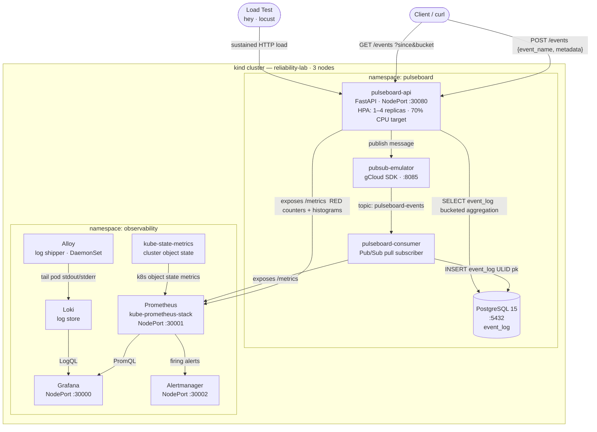

# Greg Cohen — SRE Labs

A local Kubernetes environment for practicing and demonstrating SRE skills: observable microservices, real alerting pipelines, SLO tracking, and failure injection — all running locally.

---

## What This Is

**Reliability Lab** is a self-contained SRE workspace built around a demo workload called **PulseBoard** — a small event-streaming application instrumented with RED metrics, connected to a Pub/Sub pipeline, and deployed into a kind cluster alongside a full observability stack (Prometheus, Grafana, Alertmanager, Loki).

---

## Stack

| Layer | Technology |
|-------|-----------|
| Cluster | [kind](https://kind.sigs.k8s.io/) (Kubernetes in Docker) |
| Metrics | Prometheus + kube-prometheus-stack |
| Dashboards | Grafana |
| Logs | Loki + Alloy |
| Alerting | Alertmanager |
| Messaging | Google Cloud Pub/Sub Emulator |
| Database | PostgreSQL |
| API | Python / FastAPI |
| Package mgmt | uv (Python) |
| Deployments | Helm |
| Autoscaling | Horizontal Pod Autoscaler |

---

## Architecture



---

## Repositories

| Repo | Role |
|------|------|
| [reliability-lab-bootstrap](../reliability-lab-bootstrap) | Cluster lifecycle, single-command startup (`make up-k8s`) |
| [reliability-lab-infra](../reliability-lab-infra) | Observability stack config, base Helm chart for all services |
| [pulseboard-api](../pulseboard-api) | FastAPI service — publishes events, serves aggregated data |
| [pulseboard-consumer](../pulseboard-consumer) | Pub/Sub subscriber — processes events, writes to `event_log` |
| pulseboard-ui | Frontend dashboard — *coming soon* |
| reliability-lab-experiments | Chaos and failure injection scenarios — *coming soon* |
| reliability-lab-tooling | kubectl helpers, SLO inspection utilities — *coming soon* |

---

## Quickstart

**Prerequisites:** Docker, [kind](https://kind.sigs.k8s.io/), kubectl, helm, curl

```bash
# Clone the bootstrap repo and its siblings into the same directory
git clone https://github.com/gregcohen-labs/reliability-lab-bootstrap
git clone https://github.com/gregcohen-labs/reliability-lab-infra
git clone https://github.com/gregcohen-labs/pulseboard-api
git clone https://github.com/gregcohen-labs/pulseboard-consumer

# Start everything
cd reliability-lab-bootstrap
make up-k8s
```

This single command:
1. Creates a 3-node kind cluster with NodePort mappings pre-configured
2. Installs the full observability stack (Prometheus, Grafana, Loki, Alertmanager) via Helm
3. Deploys PostgreSQL and the Pub/Sub emulator into the cluster
4. Builds and loads Docker images for pulseboard-api and pulseboard-consumer
5. Deploys both services via Helm, with HPA and ServiceMonitor enabled
6. Prints access URLs

**Access points after startup:**

| Service | URL | Credentials |
|---------|-----|-------------|
| Grafana | http://localhost:30000 | admin / prom-operator |
| Prometheus | http://localhost:30001 | — |
| Alertmanager | http://localhost:30002 | — |
| PulseBoard API | http://localhost:30080 | — |
| API docs | http://localhost:30080/docs | — |

---

## Exploring the Lab

### Generate traffic

```bash
# Emit events
curl -X POST http://localhost:30080/events \
  -H "Content-Type: application/json" \
  -d '{"event_name": "user_signup", "metadata": {"plan": "pro"}}'

# Query bucketed event counts
curl "http://localhost:30080/events?event_name=user_signup&bucket=minute"

# Check the Prometheus metrics endpoint
curl http://localhost:30080/metrics
```

### Observe in Grafana

Open http://localhost:30000 and explore:
- **Request rate** (`pulseboard_api_requests_total`) — per endpoint, per status code
- **Latency** (`pulseboard_api_request_duration_seconds`) — p50/p95/p99
- **Consumer lag** — messages in flight vs. event_log write rate
- **Pod resource usage** — CPU/memory via kube-state-metrics

### Watch the HPA respond to load

```bash
# Run a load test against the emit endpoint (requires locust or hey)
hey -z 60s -c 20 -m POST \
  -H "Content-Type: application/json" \
  -d '{"event_name": "load_test"}' \
  http://localhost:30080/events

# Watch the HPA scale up
kubectl get hpa -n pulseboard -w
```

### Inject failures and observe alerts

```bash
# Kill the consumer — watch consumer lag grow, alerts fire in Alertmanager
kubectl delete pod -n pulseboard -l app=pulseboard-consumer

# Kill postgres — watch pulseboard-api health degrade
kubectl delete pod -n pulseboard -l app=postgres

# Check what's firing
open http://localhost:30002
```

---

## Cluster management

```bash
make status       # Pod health across all namespaces
make down-k8s     # Tear down the cluster
make up-k8s       # Bring it back up (idempotent)
```

---

## What This Demonstrates

- **Kubernetes operations** — multi-node kind cluster, Deployments, Services, HPAs, resource limits
- **Observability engineering** — RED metrics, ServiceMonitors, Prometheus scrape config, Loki log shipping
- **Alerting** — Alertmanager routing, inhibition, alert grouping (more rules being added)
- **SLO thinking** — availability and latency targets, error budget burn rate tracking
- **Event-driven architecture** — Pub/Sub pipeline with at-least-once delivery semantics
- **Helm** — reusable base chart, per-service values overrides, upgrade-safe deployments
- **IaC discipline** — application infra (postgres, emulator) owned by service repos; platform infra (observability) owned by infra repo
- **Single-command DX** — `make up-k8s` goes from nothing to a fully instrumented system
